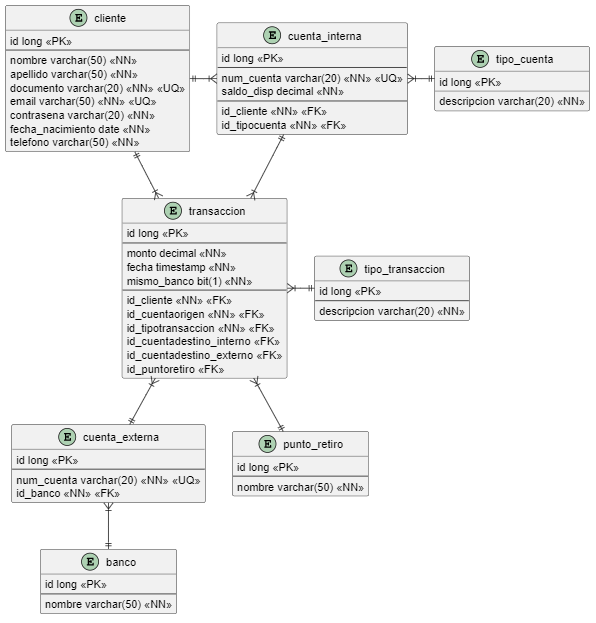

# Base de datos

Se utiliza Hosting remoto de Planet Scale para crear una base de datos relacional MySQL, con el nombre de "estubanco". Esta se construye teniendo el siguiente diagrama entidad-relación:

 

La configuración de url, username y password para establecer la conexión entre el backend con la base de datos está establecida en el archivo ***application.properties***, que se encuentra en la ruta ***server\src\main\resources\application.properties***.

 

Inicialmente se utilizó este script SQL para introducir los primeros datos a la base de datos:

~~~~sql 
INSERT INTO cliente (id, nombre, apellido, documento, email, contrasena, fecha_nacimiento, telefono)
VALUES (1,'Nelson','Cruz','1012354243','nelsonc89@gmail.com','Nelson123','1989-06-27','3208330666'),
(2,'Martha','Franco','2005749845','marthaf28@gmail.com','Martha123','1976-08-14','3145612981'),
(3,'Alejandro','García','2015986544','alej45@gmail.com','Alejandro123','1981-12-02','3004898964');

INSERT INTO tipo_cuenta (id, descripcion) VALUES (1, 'Ahorros'), (2, 'Corriente');

INSERT INTO cuenta_interna (id, num_cuenta, saldo_disp, id_cliente, id_tipocuenta)
VALUES (1, '1015489425', 765250, 1, 1), (2, '1018354896', 15000, 1, 1), (3, '2014389654', 150000, 1, 2),
(4, '1011235481', 4590846, 2, 1), (5, '2012456583', 1250000, 2, 2), 
(6, '1012568944', 10000, 3, 1), (7, '2012462555', 854230, 3, 2);

INSERT INTO tipo_transaccion (id, descripcion)
VALUES (1, 'Deposito'), (2, 'Retiro');

INSERT INTO punto_retiro (id, nombre)
VALUES (1, 'Grupo Exito'), (2, 'Puntored'), (3, 'Efecty'), (4, 'La Rebaja'),
(5, 'Red Servi'), (6, 'Multipagas'), (7, 'Practigiros'), (8, 'Megared');

INSERT INTO banco (id, nombre)
VALUES (1, 'Banco Caja Social'), (2, 'Bancolombia'), (3, 'Banco AV Villas'), (4, 'Banco de Bogotá'),
(5, 'BBVA'), (6, 'Davivienda'), (7, 'Banco de Occidente'), (8, 'Banco Pichincha'), 
(9, 'Bancamia'), (10, 'Banco Popular');

INSERT INTO cuenta_externa (id, num_cuenta, id_banco)
VALUES (1, '1113275916', 1);

INSERT INTO transaccion (id, monto, fecha, mismo_banco, id_cliente, id_cuentaorigen, id_tipotransaccion, 
id_cuentadestino_interno, id_cuentadestino_externo, id_puntoretiro)
VALUES (1, 10000, CURRENT_TIMESTAMP, 0, 1, 1, 1, null, 1, null);
~~~~

