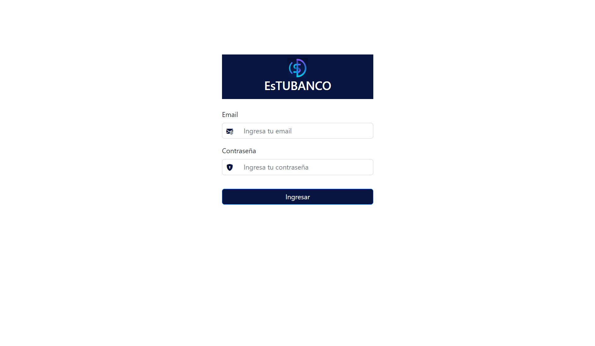
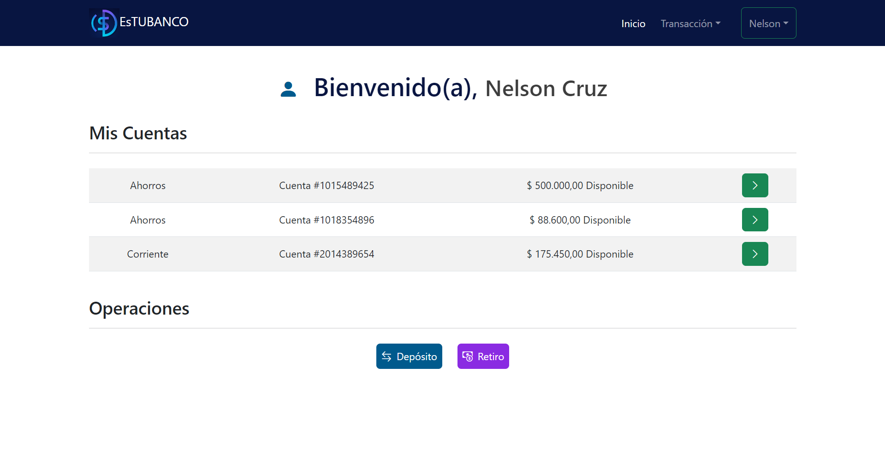
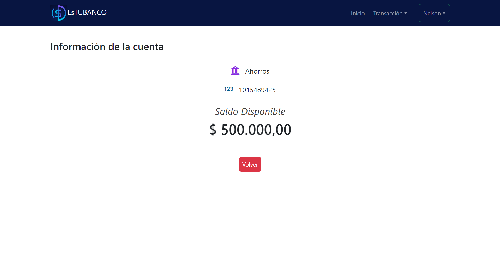
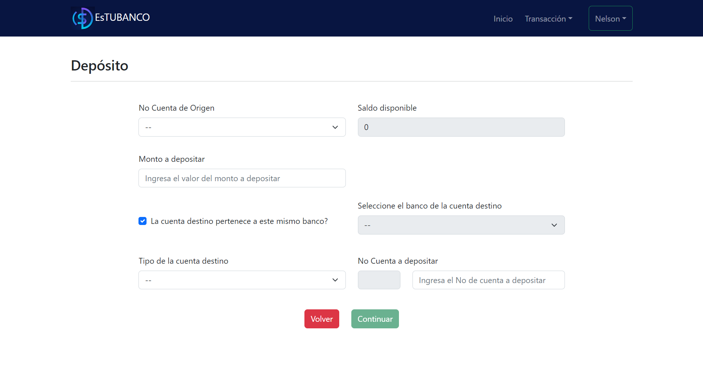
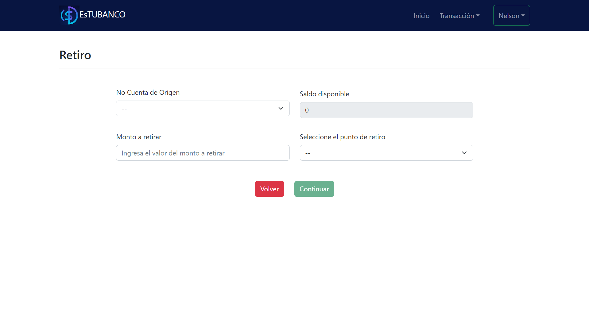
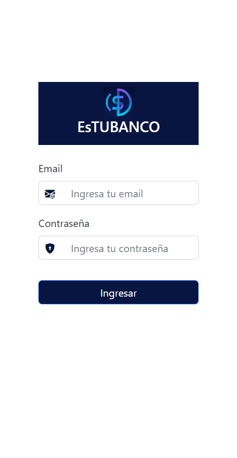
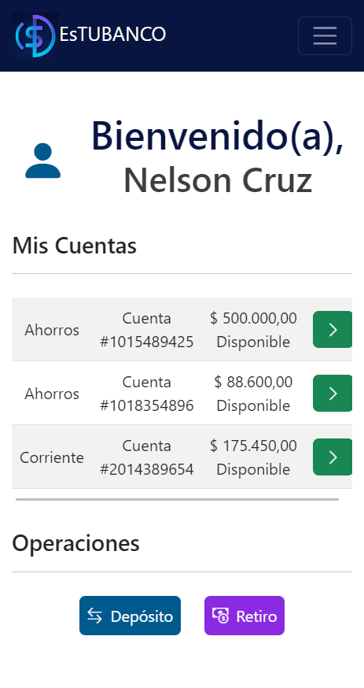
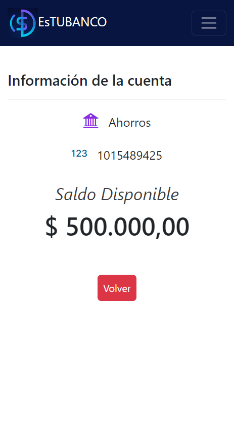
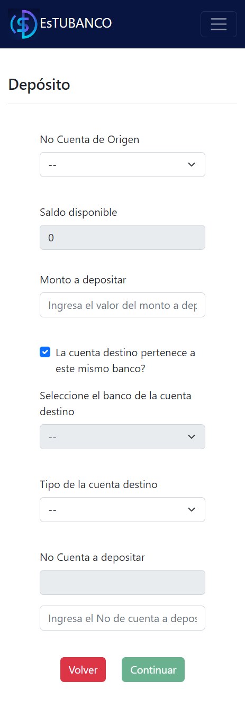
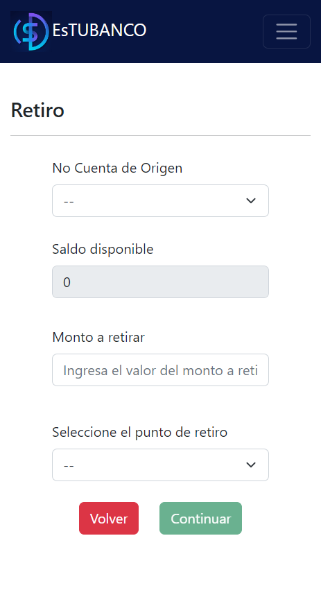

# Desarrollo Frontend

El frontend se desarrollo usando:
- Node.js vs 16.18.0
- React vs 18.2.0
- Extensión de Google Chrome de React Developer Tools. 

Entonces, se usaron las siguientes dependencias, que son necesarias para la ejecución del proyecto:
-  axios vs 1.3.3 
-  bootstrap vs 5.2.3
-  bootstrap-icons vs 5.2.3
-  js-cookie vs 3.0.1
-  react vs 18.2.0
-  react-bootstrap vs 2.7.2
-  react-dom vs 18.2.0
-  react-router-dom vs 6.8.1
-  react-scripts vs 5.0.1

Adicional, se usaron las siguientes dependencias que fueron necesarias durante el desarrollo del proyecto:
- testing-library/jest-dom vs 5.16.5
- testing-library/react vs 14.0.0
- jest vs 27.5.1

El frontend siempre inicia por defecto en el puerto 3000, en la siguiente url: ***http://localhost:3000/***

Se desarrollaron las siguientes interfaces web:
- Interfaz de Login: el usuario podrá iniciar sesión para ingresar a la aplicación. Al iniciar sesión correctamente ingresará a la interfaz de Home.
- Interfaz de Inicio: es la página principal donde el usuario podrá visualizar en una tabla el estado de todas sus cuentas, seleccionar la cuenta que desee revisar y también dispondrá de unos botones para dirigirse a las interfaces de depósito o retiro. 
- Interfaz de Detalle de la Cuenta: esta provee al usuario el número, tipo y saldo disponible en la cuenta seleccionada.
- Interfaz de Depósito: aquí el usuario podrá transferir dinero a otras cuentas del mismo banco o cuentas externas que tienen convenio con el banco, pero la único requisito es que deben ser depósitos mayores o iguales a 1000 pesos y que no excedan su saldo disponible.
- Interfaz de Retiro: aquí el usuario podrá gestionar el retiro de su dinero seleccionando los puntos de retiro que tienen convenio con el banco, pero el único requisito es que los retiros deben ser mayores o iguales a 20000 pesos y no deben exceder su saldo disponible.

Primero se desarrollaron las interfaces web adaptadas para PC, que se muestran a continuación:
 

- Interfaz de Login:

 

- Interfaz de Home:

 

- Interfaz de Detalles de la cuenta:

 

- Interfaz de Depósito:

 

- Interfaz de Retiro:

  

Luego se desarrollaron las interfaces web adaptadas para mobile y quedaron de la siguiente manera:
 

- Interfaz de Login:

 

- Interfaz de Home:

 

- Interfaz de Detalles de la cuenta:

 

- Interfaz de Depósito:

 

- Interfaz de Retiro:

