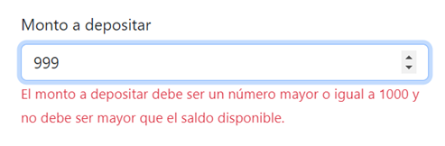

# Como usar la aplicación:

A continuación se muestran las instrucciones de como usar la aplicación.

## Página de Login

- La aplicación inicia en la página de Login. Aquí se debe ingresar un correo y contraseña válidos para poder acceder a la aplicación. Aquí se muestran algunos de estos con los cuales se puede ingresar. 

    

    
    

     
- Hay que tener en cuenta lo siguiente: 

   - Si se deja en blanco uno o los dos campos, aparece un mensaje de error.

        

        
        

     

    - Si se ingresan mal las credenciales en los campos, también aparece un mensaje de error. 

        

        
        

     

    - Si se ingresan correctamente las credenciales en los campos, aparece un mensaje de login exitoso. 

        

        
        

 

---
## Página de Home
- Al acceder correctamente se tiene ingreso a la página de Home, la cual cuenta con lo siguiente:

    

    
    

 

---
## Barra de Navegación:
- Una vez que se tiene acceso a la aplicación aparecerá una barra de navegación en todas las páginas, desde la cual se podrá navegar a la página de Home, Depósito, Retiro o cerrar sesión. 
  
  - Desde la pestaña de *Inicio* se podrá navegar a la página principal y desde la pestaña de *Transacción* se podrá navegar a la *página de Depósito* y a la *página de Retiro*.
  
    

    
    

     

  - Desde la pestaña donde está el nombre del usuario se podrá cerrar sesión.   
  
    

    
    

---
## Página de Detalles de Cuenta
- Cuando se da clic en alguno de los botones de la tabla *Mis Cuentas* de la ***Página Home***, se puede acceder a la ***Página de Detalles de la Cuenta***, que es donde se muestra la información de una cuenta específica. Para este ejemplo se accede a la cuenta de la primera fila.

    

    
    

---
## Página de Depósito
- Al acceder a esta página desde el menú de navegación o desde el botón ***Depósito***  de la ***página de Home***, aparecerá de la siguiente manera:

    

    
    

 

- Para digilenciar el formulario se debe tener en cuenta:

    - Seleccionar una de las cuentas internas o cuentas de origen desde la cual se va a realizar el depósito.

        

        
        

      

    - Una vez seleccionada el No de Cuenta Origen, automáticamente aparecerá el saldo disponible asociado a esa cuenta.
  
        

        
        

     

    - En el campo de ***monto a depositar*** se deberá ingresar un valor superior o igual a 1000 pesos y que no sea superior al saldo disponible. En caso de utilizar decimales se utilizará el punto y solo se pueden usar dos cifras decimales. 
  
      - Este es el ejemplo de un monto que ha sido ingresado correctamente.
  
        

        
        

       

      - Este es el otro ejemplo de un monto con notación decimal, pero también ha sido ingresado correctamente.
  
        

        
        

    
       

      - Si se ingresa un monto menor a 1000 pesos saldrá un mensaje de error.
  
        

        
        

       

      - Si se ingresa un monto mayor al saldo disponible también saldrá el mensaje de error.
  
        

        
        

     

    - Dependiendo si la cuenta a la cual se le va a transferir el depósito es del mismo banco o no, se debe seleccionar alguna de las siguientes opciones:
  
      - Si es del mismo banco, se selecciona la casilla ***La cuenta destino pertenece al mismo banco?*** y automáticamente de deshabilita la selección de la cuenta destino.

        

        
        

       

      - Si NO es del mismo banco, se quita la selección de la casilla ***La cuenta destino pertenece al mismo banco?*** y se deberá seleccionar dentro de las opciones el banco al cual está asociada la cuenta destino.

        

        
        

       

    - Seleccionar el tipo de cuenta de destino, si es de ahorros o corriente.

        

        
        

     

    - Para el campo ***No Cuenta a depositar*** también se tiene que tener en cuenta si está cuenta es del mismo banco o pertenece a otro banco, para así seleccionar alguna de las siguientes opciones:
    
      - Si es del mismo banco, al seleccionar el check de ***La cuenta destino pertenece al mismo banco?*** y al seleccionar el tipo de cuenta (Ahorros o Corriente), automáticamente aparecerá el código del mismo banco para ese tipo de cuenta. Luego se deberá digitar los 7 últimos números de la cuenta interna a la cual se va a realizar el depósito. Hay que aclarar que no se puede realizar un depósito a la misma cuenta de origen y tiene que ser una cuenta existente. 

        

        
        

    
        

      - Si es de distinto banco, al seleccionar el banco de la cuenta destino y el tipo de cuenta (Ahorros o Corriente), automáticamente aparecerá el código del correspondiente banco asociado a ese tipo de cuenta. Luego, igual que el caso anterior, se deberá digitar los 7 últimos números de la cuenta externa a la cual se va a realizar el depósito. 

        

        
        

        

      - Tanto para que la cuenta destino sea interna o externa, si no se digitan los siete últimos números de la cuenta, aparecerá un mensaje de error. 

        

        
        

     

    - Un ejemplo de formulario de depósito diligenciado correctamente quedaría de la siguiente manera:
  
      - Para realizar un depósito a una cuenta existente del mismo banco:

        

        
        

         

      - Para realizar un depósito a una cuenta de otro banco:

        

        
        

 

- Luego de darle continuar al formulario de depósito aparecerá una ventana para poder confirmar o cancelar el envío del depósito. 

    

    
    

- Si ocurre un error en el envío del depósito tal vez debido al número de cuenta de destino o algún otro error del servidor, aparecerá la siguiente ventana de error:

    

    
    

- Pero si todo sale satisfactoriamente en el envío del depósito, aparecerá la siguiente ventana de éxito:

    

    
    

 

## Página de Retiro
- Al acceder a esta página desde el menú de navegación o desde el botón ***Retiro***  de la ***página de Home***, aparecerá de la siguiente manera:

    

    
    

 

- Para digilenciar el formulario se debe tener en cuenta:

    - Seleccionar una de las cuentas internas o cuentas de origen desde la cual se va a realizar el retiro. Una vez seleccionada, automáticamente aparecerá el saldo disponible asociado a esta cuenta
  
        

        
        

     

    - En el campo de ***monto a retirar*** se deberá ingresar un valor superior o igual a 20000 pesos y que no sea superior al saldo disponible. En caso de utilizar decimales se utilizará el punto y solo se pueden usar dos cifras decimales. 
  
      - Este es el ejemplo de un monto que ha sido ingresado correctamente.
  
        

        
        

       

      - Este es el otro ejemplo de un monto con notación decimal, pero también ha sido ingresado correctamente.
  
        

        
        

    
       

      - Si se ingresa un monto menor a 20000 pesos saldrá un mensaje de error.
  
        

        
        

       

      - Si se ingresa un monto mayor al saldo disponible también saldrá el mensaje de error.
  
        

        
        

     

    - Seleccionar el punto de retiro.

        

        
        

     

    - Un ejemplo de formulario de retiro diligenciado correctamente quedaría de la siguiente manera:
  
    

    
    

     

- Luego de darle continuar al formulario de retiro aparecerá una ventana para poder confirmar o cancelar el envío del retiro. 

    

    
    

- Si ocurre un error en el envío del retiro tal vez debido al servidor, aparecerá la siguiente ventana de error:

    

    
    

- Pero si todo sale satisfactoriamente en el envío del retiro, aparecerá la siguiente ventana de éxito:

    

    
    
